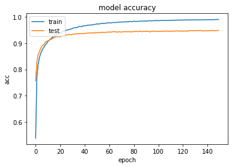

# Speech classification

## Goal
In this challenge, the goal is to learn to recognize which of several English words
is pronounced in an audio recording. This is a multiclass classification task.

## Requirements

• tensorflow\
• keras\
• imblearn\
• python_speech_features\
• librosa

or run below code in your prompt window after git cloning this repository

```
pip install -r requirements.txt
```

## Data files

• wav.tgz: a compressed directory with all the recordings (training and test
data) in the form of wav files.\
wav.tgz can be downloaded here: https://surfdrive.surf.nl/files/index.php/s/A91xgk7B5kXNvfJ

• train.csv: this file contains two columns: path with the filename of the recording and word with word which was pronounced in the recording.
This is the training portion of the data.

• test.csv: This is the testing portion of the data, and it has the same
format as the file train.csv except that the column word is absent.

# Approach

## Data extraction
The first step was loading the data into Jupyter and defining the distribution of the
training and testing data. The training file names and labels were extracted from train.csv and the testing file names were extracted from test.csv. These file names were used in order to match the correct wav files from wav.tgz. In this case, python_speech_features were used in order to extract custom Mel Frequency Cepstral Coefficients (MFCCs). The extraction of the features and labels resulted in a training set of 94824
examples and a test set consisting of 11005 unlabeled examples.

## Feature engineering
While exploring the extracted Mel Frequency Cepstral Coefficients (MFCCs), we discovered
unequal dimensions, such as (99, 13), (96, 13) and (92, 13). Therefore, the extracted features
were zero-padded in order to match the largest dimension. Zero-padding the Mel Frequency
Cepstral Coefficients resulted in an array of (94824 99, 13) examples for the training set and an
array consisting of (11005, 99, 13) examples for the test set. In the second step, the class
distribution was computed in order to comprehend the distribution of all labels. The class
distribution was quite imbalanced which could disturb the learning capacity of our
machine learning model. Thus, the training set was oversampled in order to match the majority
class. The SMOTE oversampling method by “Imblearn.over_sampling” was used to oversample
our examples in order to match the majority class. In the third step, standardization was applied
in order to change the values of numeric columns in the dataset to a common scale, without
distorting differences in the ranges of values. In the fourth step, the labels were one-hot
encoded before being split into training and validation sets.

## Convolutional Neural Network and parameter tuning
The deep learning architecture used, consisted a 1 Dimensional Convolutional Neural Network. This approach was inspired by existing literature on environmental sound classification with convolutional neural networks (Piczak, 2015). A conv1D layer, maxpooling1D layer, dropout layer, and dense layer was used.
The following parameters were tuned:
1. Hyperparameters related to the network structure\
• Different experiments were executed by adding hidden layers until the test error did not improve anymore.\
• Dropout was used in order to avoid overfitting. Dropout was set to 30%.

2. Hyperparameters related to Training Algorithm\
• The number of epochs was tuned until the validation set started to level out

### Model accuracy



## Literature
Luengo, J., Fernández, A., García, S., & Herrera, F. (2011). Addressing data complexity for imbalanced data sets: analysis of SMOTE-based oversampling and evolutionary undersampling.Soft Computing,15(10), 1909-1936.

Piczak, K. J. (2015, September). Environmental sound classification with convolutional neural networks. In2015 IEEE 25th International Workshop on Machine Learning for Signal Processing (MLSP)(pp. 1-6). IEEE.

## grade received 
9.1
